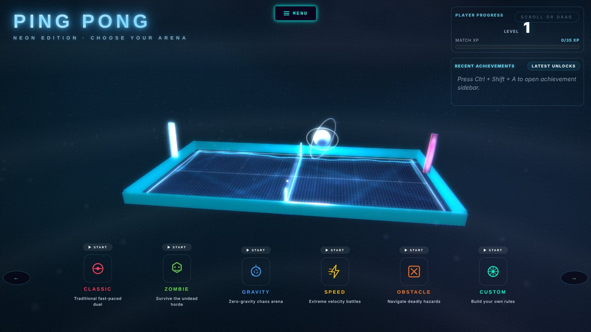
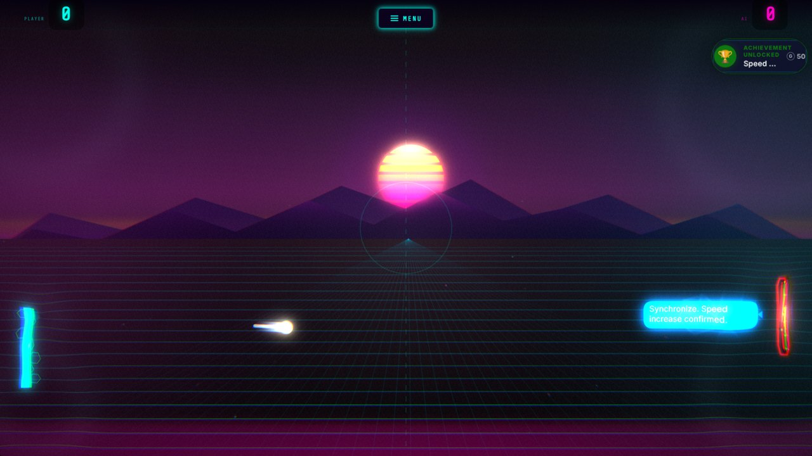
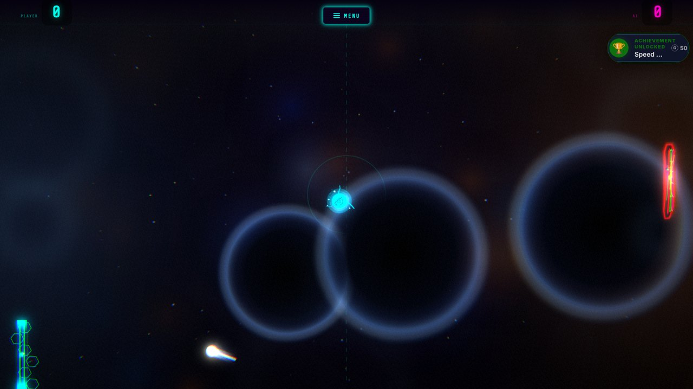
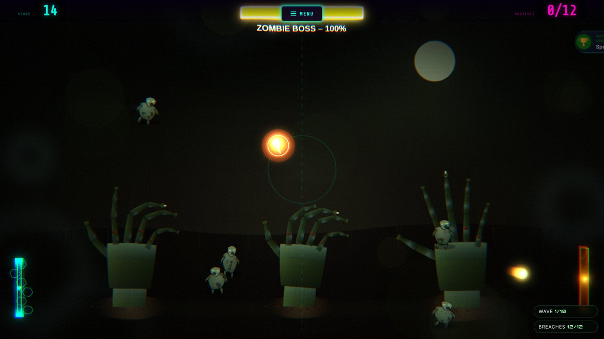
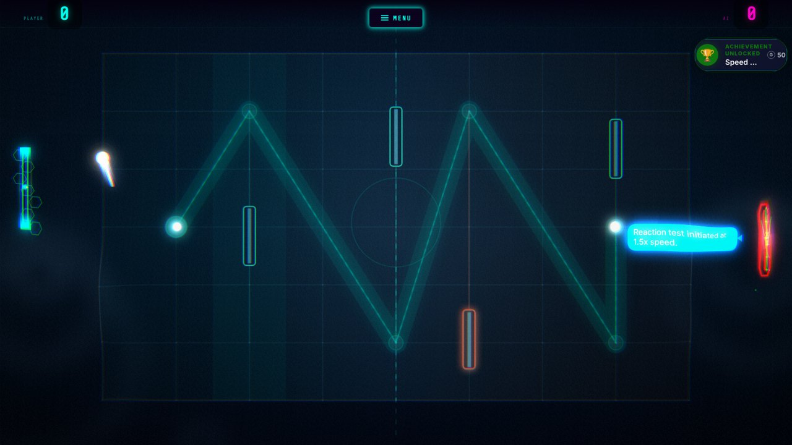

# Ping Pong — Neon Edition

A browser ping pong game with five arenas that each play differently, a ball
physics engine written in C++ and compiled to WebAssembly, GPU shader
post-processing, and a level/XP/achievement system.



## Play it (testers start here)

**Windows:** double-click **`Play Ping Pong.bat`**.

That's it — nothing to install. The batch file starts a tiny local web server
using PowerShell (built into Windows) and opens the game in Chrome or Edge.
Keep the small console window open while you play; close it to stop.

- **Esc** pauses · **W / S** or mouse/touch moves the left paddle · **↑ / ↓** moves
  the right paddle in local 1v1 · **Space** fires the laser power-up
- **F2** shows a performance readout: FPS, detected display refresh rate,
  quality tier, render scale, shaders and physics backend.
- Your progress (XP, achievements) is saved in the browser on this PC.

**Other systems:** serve the `game/` folder with any static web server, e.g.
`python -m http.server 8080 --directory game`, then open
<http://127.0.0.1:8080/>.

### Getting 120 FPS on a laptop

The game runs at your display's refresh rate and adapts its quality to hold it.

1. Set the laptop screen to its highest refresh rate (Windows: *Settings → System
   → Display → Advanced display → Choose a refresh rate*).
2. Plug the laptop in — on battery, Windows and the GPU often cap frame rates.
3. Launch with `Play Ping Pong.bat`: it starts the browser with the dedicated
   GPU preferred (`--force-high-performance-gpu`) and GPU rasterisation on.
4. Press **F2** in a match to check the frame rate and quality tier.

On a 60 Hz screen you can run `"Play Ping Pong.bat" uncapped` from a command
prompt to unlock frame rates above 60 (expect some screen tearing).

## Five arenas, one engine

| Mode | What changes |
|---|---|
| **Classic** | The straight duel: fast, clean, no gimmicks. |
| **Zombie** | Survive ten waves of undead and a boss while still returning the ball. |
| **Gravity** | Gravity wells bend the ball's path; use them to slingshot shots. |
| **Speed** | The ball keeps accelerating; reaction challenges interrupt the rally. |
| **Obstacle** | Moving gates and nodes carve up the court. |

Plus **Custom** (local 1v1 with your own paddles, background, music and
power-ups), **Ball Forge** (a ball skin editor), local 1v1 for any mode, and a
persistent level / XP / achievement system.

<table>
<tr>
<td width="50%"><br/><sub><b>Classic</b></sub></td>
<td width="50%"><br/><sub><b>Gravity</b></sub></td>
</tr>
<tr>
<td width="50%"><br/><sub><b>Zombie</b></sub></td>
<td width="50%"><br/><sub><b>Obstacle</b></sub></td>
</tr>
</table>

## How it plays: the physics

Ball physics live in [`physics/physics.cpp`](physics/physics.cpp), compiled to a
3.5 KB WebAssembly module that's embedded in the game (so it also loads from
`file://`). A JavaScript port of the same model takes over only if WebAssembly
is unavailable.

- **Spin you can see.** Moving the paddle as you hit brushes spin onto the ball
  (Magnus effect), so it curves in flight. Spin decays over time and kicks the
  ball forward off the side rails.
- **English.** Some of the paddle's motion carries into the return.
- **Aim by contact point.** Centre hits stay flat; edge hits angle sharply.
- **No tunnelling.** Paddle collisions are swept along the ball's path, so even
  the fastest balls can't pass through a paddle between frames.
- **Rallies build gradually** instead of jumping to max speed.
- **Impact feel:** hit-stop, paddle recoil and squash, impact-scaled screen
  shake and shader shockwaves.
- The AI predicts the ball with the exact same C++ integrator, so it reads
  curving shots; difficulty limits how far ahead it can see.

## Graphics

- **Game:** the playfield is drawn with Canvas 2D, then run through a WebGL
  post-process ([`game/js/render/post-fx.js`](game/js/render/post-fx.js)):
  two-level bloom, a procedural lens-dirt texture lit by the bloom, impact
  shockwave ripples, chromatic punch on hard hits, per-mode colour grading,
  vignette, scanlines and film grain.
- **Menu:** a Three.js scene with a storm-sea court shader, a procedural carbon
  weave court texture, an animated aurora and starfield sky shader, and its own
  bloom pass ([`game/js/menu/menu-bloom.js`](game/js/menu/menu-bloom.js)).
- **Adaptive quality:** `PerfGovernor` learns the display refresh rate and,
  if frames are missed, steps down glow, particles, render resolution and
  post-fx quality — then steps back up when there's headroom.

## Project layout

```
Play Ping Pong.bat        Double-click to play (Windows)
game/                     Everything the browser loads
  index.html                Intro / boot screen
  play.html                 Menu + game
  ball-studio.html          Ball Forge skin editor
  css/                      Stylesheets (incl. locally bundled fonts)
  js/
    core/                   Game class, globals + quality governor, vectors, boot
    entities/               Ball, paddles, power-ups, gravity wells
    modes/                  Zombie boss, obstacle course, speed challenge
    render/                 Background renderer, WebGL post-processing
    menu/                   Three.js menu + menu bloom
    physics/                WebAssembly physics bridge (+ background simulation worker)
    audio/  fx/  systems/  ui/  app/
    vendor/                 three.js r128, anime.js (no CDN needed)
  assets/                   audio/, fonts/, images/
physics/                  C++ source for the physics engine + build scripts
tools/serve.ps1           Zero-dependency local web server used by the .bat
docs/screenshots/         Images for this README
```

## Rebuilding the physics engine

Only needed if you change `physics/physics.cpp`. You need clang with the
WebAssembly target (LLVM 14+; on Windows `winget install LLVM.LLVM`):

```
physics\build.ps1        (Windows)
physics/build.sh         (macOS / Linux)
```

This regenerates `game/js/physics/physics-binary.js`. See
[`physics/README.md`](physics/README.md) for details.
