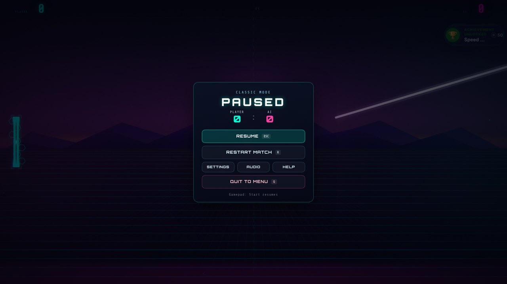

# Ping Pong — Neon Edition

A browser ping pong game with five arenas that each play differently, a ball
physics engine written in C++ and compiled to WebAssembly, GPU shader
post-processing, and a level/XP/achievement system.


## Play it (testers start here)

**Windows:** double-click **`Play Ping Pong.bat`**.

That's it — nothing to install. The batch file starts a tiny local web server
using PowerShell (built into Windows) and opens the game in Chrome or Edge.
Keep the small console window open while you play; close it to stop.

- **Esc** pauses · **W / S**, or hold the mouse button / touch and drag, moves the left paddle · **↑ / ↓** moves
  the right paddle in local 1v1 · **Space** fires the laser power-up
- **Gamepad:** left stick or d-pad moves (analog), **A** fires the laser / skips
  intros, **Start** pauses; a second pad controls the right paddle in local 1v1.
  Controllers rumble on hits and goals.
- **Phones / tablets:** play in landscape (the match pauses if you turn the
  phone upright; Android goes fullscreen and locks landscape when a match
  starts). Drag anywhere on your half to move your paddle (it follows your
  finger's movement, so your finger never covers the ball); tap with a second
  finger to fire the laser. Instant replays never interrupt a match on mobile:
  after a great point a **▶ REPLAY** chip shows for a few seconds, so tap it
  only if you want to watch.
- **F2** shows a performance readout: FPS, detected display refresh rate,
  quality tier, render scale, shaders and physics backend.
- Intros can be skipped: click or press any key during the boot cinematic,
  and **Esc** / the **Skip intro** button during a match intro (after the first
  match, match intros are short anyway).
- Your progress (XP, achievements) is saved in the browser on this PC.

### Let testers anywhere play it (PC + mobile)

Double-click **`Share Online (PC + Mobile).bat`** on the Windows PC that has the
game. After a few seconds it shows a public link like
`https://some-random-words.trycloudflare.com/` (also copied to the clipboard)
and opens a page with a QR code for phones. Send that link to anyone, in any
country: they open it in Chrome, Edge, Safari or Firefox on a PC or phone and
play, with nothing to install. You can play on your own PC at the same time.

- Each tester plays their own game in their own browser; their progress is
  saved on their device.
- It uses a free Cloudflare quick tunnel, so there's no account to make and no
  router or firewall setup. The first run downloads Cloudflare's
  `cloudflared.exe` (about 60 MB) into `tools\bin`.
- Only the `game/` folder is shared, read-only. The link is random, changes on
  every run, and stops working as soon as you close the window.
- The game is about 50 MB, mostly music that streams as it plays, and it's sent
  from your PC, so your upload speed decides how fast testers' first load is.
- The QR code image comes from api.qrserver.com.

**Other systems:** serve the `game/` folder with any static web server, e.g.
`python -m http.server 8080 --directory game`, then open
<http://127.0.0.1:8080/>.

### Getting 120 FPS on a laptop

The game runs at your display's refresh rate and adapts its quality to hold it.

1. Set the laptop screen to its highest refresh rate (Windows: *Settings → System
   → Display → Advanced display → Choose a refresh rate*).
2. Plug the laptop in — on battery, Windows and the GPU often cap frame rates.
3. Launch with `Play Ping Pong.bat`: it starts the browser with the dedicated
   GPU preferred (`--force-high-performance-gpu`) and GPU rasterisation on.
4. Press **F2** in a match to check the frame rate and quality tier.

On a 60 Hz screen you can run `"Play Ping Pong.bat" uncapped` from a command
prompt to unlock frame rates above 60 (expect some screen tearing).

## Five arenas, one engine

| Mode | What changes |
|---|---|
| **Classic** | The straight duel: fast, clean, no gimmicks. |
| **Zombie** | Survive ten waves of undead and a boss while still returning the ball. |
| **Gravity** | Gravity wells bend the ball's path; use them to slingshot shots. |
| **Speed** | The ball keeps accelerating; reaction challenges interrupt the rally. |
| **Obstacle** | Moving gates and nodes carve up the court. |

Plus **Custom** (local 1v1 with your own paddles, background, music and
power-ups), **Ball Forge** (a ball skin editor), local 1v1 for any mode, and a
persistent level / XP / achievement system.

<table>
<tr>
<td width="50%"><br/><sub><b>Classic</b></sub></td>
<td width="50%"><br/><sub><b>Gravity</b></sub></td>
</tr>
<tr>
<td width="50%"><br/><sub><b>Zombie</b></sub></td>
<td width="50%"><br/><sub><b>Obstacle</b></sub></td>
</tr>
<tr>
<td width="50%"><br/><sub><b>Pause menu</b>: resume, restart, settings, audio, help, quit</sub></td>
<td width="50%"></td>
</tr>
</table>

## How it plays: the physics

Ball physics live in [`physics/physics.cpp`](physics/physics.cpp), compiled to a
3.5 KB WebAssembly module that's embedded in the game (so it also loads from
`file://`). A JavaScript port of the same model takes over only if WebAssembly
is unavailable.

- **Spin you can see.** Moving the paddle as you hit brushes spin onto the ball
  (Magnus effect), so it curves in flight. Spin decays over time and kicks the
  ball forward off the side rails.
- **English.** Some of the paddle's motion carries into the return.
- **Aim by contact point.** Centre hits stay flat; edge hits angle sharply.
- **No tunnelling.** Paddle collisions are swept along the ball's path, so even
  the fastest balls can't pass through a paddle between frames.
- **Rallies build gradually** instead of jumping to max speed.
- **Impact feel:** hit-stop, paddle recoil and squash, ball squash/stretch,
  trauma-style screen shake with a directional camera kick, and shader
  shockwaves, all scaled by how hard the ball was hit.
- **Readable spin:** arcs orbit the ball at the speed and in the direction of
  its spin, so you can see a curving shot coming.
- **Sound you can feel:** layered impacts (transient click, pitched body, low
  thump on hard hits) that get louder and brighter with speed, panned to where
  they happen; the two paddles are pitched differently: ping… pong.
- **Rallies build:** a live rally counter grows and warms in colour, with a
  callout every 5 hits; returning the ball off the very tip of the paddle
  earns a **CLUTCH!** slow-mo beat. The ball's trail heats up with speed.
- **Living paddles:** on top of each paddle's design, a light band sweeps
  along it, the striking face lights up and the corner brackets tighten as
  the ball comes in, outlines trail it at speed and a ring snaps out on
  contact (plain strokes, ~0.05 ms per paddle; bloom adds the glow).
- **Every point lands:** goals get a shockwave, flash and camera punch, then a
  short telegraphed serve (countdown ring + direction chevrons) towards the
  player who conceded.
- **Mouse/touch control has real momentum**, so mouse players can put spin
  and english on the ball too, and paddles are interpolated between physics
  steps so they stay smooth on 144/165 Hz screens.
- The AI predicts the ball with the exact same C++ integrator, so it reads
  curving shots; difficulty limits how far ahead it can see.

## Graphics

- **Game:** the playfield is drawn with Canvas 2D, then run through a WebGL
  post-process ([`game/js/render/post-fx.js`](game/js/render/post-fx.js)):
  two-level bloom, a procedural lens-dirt texture lit by the bloom, impact
  shockwave ripples, chromatic punch on hard hits, per-mode colour grading,
  vignette, scanlines and film grain.
- **Menu:** a Three.js scene with a storm-sea court shader, a procedural carbon
  weave court texture, an animated aurora and starfield sky shader, and its own
  bloom pass ([`game/js/menu/menu-bloom.js`](game/js/menu/menu-bloom.js)).
- **Adaptive quality:** `PerfGovernor` learns the display refresh rate and,
  if frames are missed, steps down glow, particles, render resolution,
  background animation rate and post-fx quality (the lowest tier turns the
  shader pass off) — then steps back up when there's headroom. At the top
  tier animated backgrounds redraw every frame, so nothing judders at 120 Hz.

## Project layout

```
Play Ping Pong.bat        Double-click to play (Windows)
Share Online (PC + Mobile).bat   Public link + QR code so remote testers can play
game/                     Everything the browser loads
  index.html                Intro / boot screen
  play.html                 Menu + game
  ball-studio.html          Ball Forge skin editor
  css/                      Stylesheets (incl. locally bundled fonts)
  js/
    core/                   Game class, globals + quality governor, vectors, boot
    entities/               Ball, paddles, power-ups, gravity wells
    modes/                  Zombie boss, obstacle course, speed challenge
    render/                 Background renderer, WebGL post-processing
    menu/                   Three.js menu + menu bloom
    physics/                WebAssembly physics bridge (+ background simulation worker)
    audio/  fx/  systems/  ui/  app/
    vendor/                 three.js r128, anime.js (no CDN needed)
  assets/                   audio/, fonts/, images/
physics/                  C++ source for the physics engine + build scripts
tools/serve.ps1           Zero-dependency local web server used by the .bat files
tools/share.ps1           Cloudflare quick tunnel for "Share Online"
docs/screenshots/         Images for this README
```

## Rebuilding the physics engine

Only needed if you change `physics/physics.cpp`. You need clang with the
WebAssembly target (LLVM 14+; on Windows `winget install LLVM.LLVM`):

```
physics\build.ps1        (Windows)
physics/build.sh         (macOS / Linux)
```

This regenerates `game/js/physics/physics-binary.js`. See
[`physics/README.md`](physics/README.md) for details.
