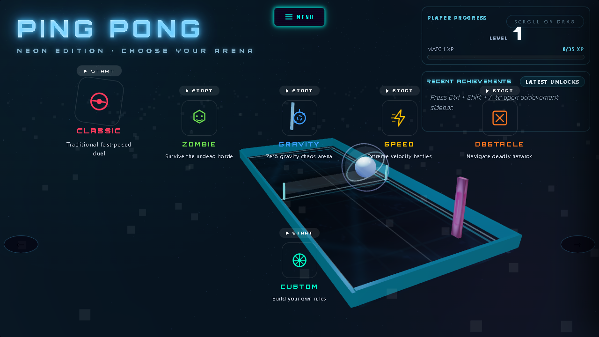
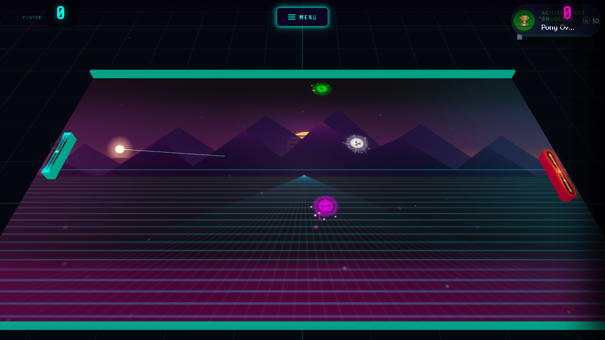
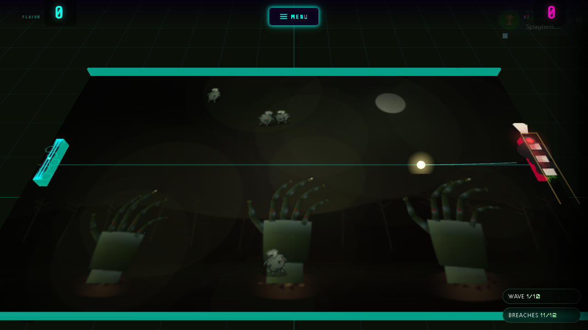
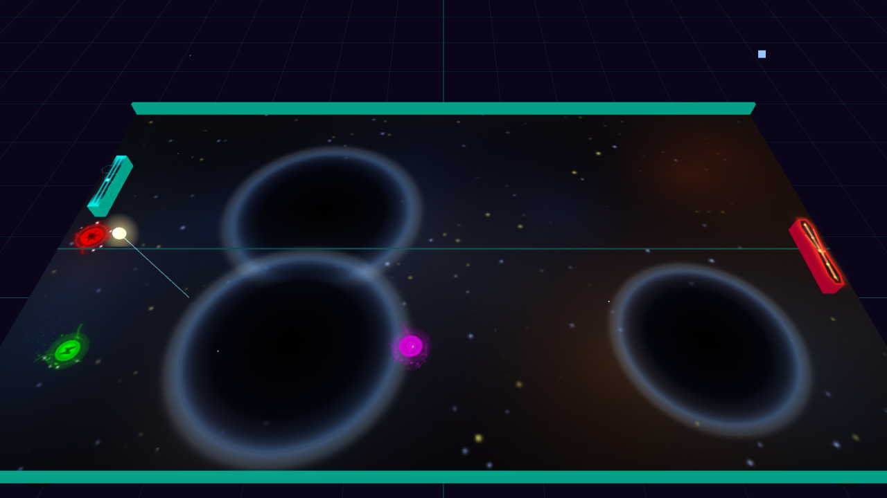
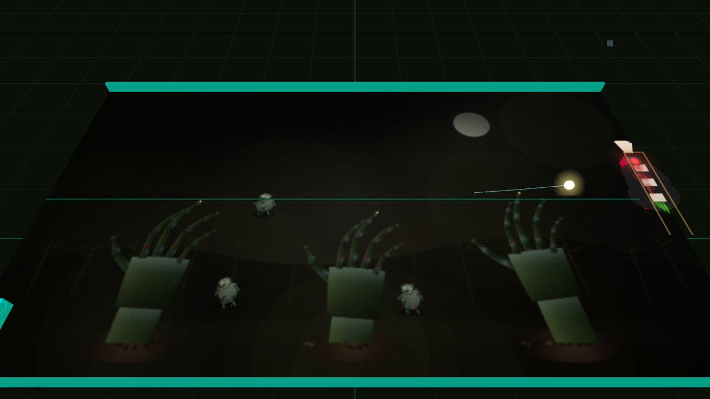
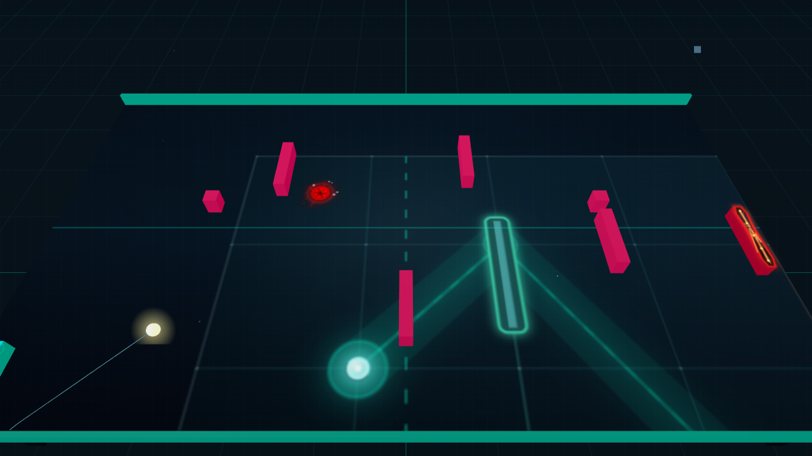

# 🏓 Ping Pong — Neon Edition

A browser ping pong game that outgrew "ping pong" a while ago: five arenas with genuinely different rulesets, a C++/WebAssembly physics core, an achievement and progression system, and — as of this build — an optional real-time 3D renderer that sits on top of the same simulation.

No install, no build step to play. Open `ping_pong.html` (or run `run-game.bat`) and you're in.



---

## Play it

**Windows, fastest path:** double‑click [`run-game.bat`](run-game.bat). It starts a local server, waits for it to come up, and opens the game in Chrome. Closing the minimised server window stops it.

**Anywhere else:**
```bash
npm install
npm start        # serves on http://localhost:8080 and opens the game
```

WebAssembly requires the game to be served over HTTP — opening `ping_pong.html` directly via `file://` will disable the physics engine's WASM path.

---

## Five arenas, one engine

Every mode shares the same physics core and paddle logic, but changes the rules enough to actually feel like a different game.

| Mode | What changes |
|---|---|
| **Classic** | The original duel — fast, clean, no gimmicks. |
| **Zombie** | Survive waves of undead climbing out of the arena floor while still returning the ball. Boss fights, pickups, a wave counter. |
| **Gravity** | Orbiting gravity wells bend the ball's path in real time — the arena itself is the opponent. |
| **Speed** | Velocity escalates the longer a rally runs. A synthwave highway backdrop that reacts to the pace. |
| **Obstacle** | Rotating gates, nodes, and rotors carve up the court; laser sight-lines telegraph the AI's aim. |

There's also a **Custom** mode for building your own rule combinations, a full **paddle/ball customisation** studio, and a persistent **level/XP/achievement** system that tracks progress across matches.

<table>
<tr>
<td width="50%"><br/><sub><b>Classic</b> — synthwave backdrop, power-ups, live ball trail</sub></td>
<td width="50%"><br/><sub><b>Zombie</b> — wave counter, breach tracker, boss AI</sub></td>
</tr>
</table>

---

## The 2.5D renderer

The game ships two renderers over the same simulation: the original 2D canvas, and a WebGL-based perspective renderer built on **three.js**. The 2D physics stays authoritative in both — the 3D view is a camera looking at the same game state, not a separate game. Press **`3`** during a match to switch between them live.

Rather than re-drawing each mode's art from scratch in 3D, the renderer drives the game's *own* 2D drawing code (backgrounds, power-ups, gravity wells, zombie hands, paddle skins) into offscreen textures and projects them onto the 3D table. So the art is identical to the 2D version by construction — same palette, same animations — just viewed in perspective, with real paddle geometry, a glowing ball with a GPU-side trail, and an arena (grid floor, neon pillar horizon) instead of empty space around the table.

<table>
<tr>
<td width="33%"><br/><sub>Gravity — wells rendered in perspective</sub></td>
<td width="33%"><br/><sub>Zombie — hands rise from the play surface</sub></td>
<td width="33%"><br/><sub>Obstacle — laser sight-lines in depth</sub></td>
</tr>
</table>

---

## Under the hood

- **Physics core in C++, compiled to WebAssembly** (`physics/`) — ball integration, paddle collision, and AI prediction run outside the JS main thread, with a pure-JS fallback if WASM isn't available.
- **Adaptive quality governor** — measures rolling frame time and scales visual cost (glow, particle density) down automatically on slower hardware, and back up when there's headroom, rather than hard-coding a "low/high" toggle.
- **A from-scratch 2.5D renderer** (`renderer3d.js`) built on three.js, sharing game state with the 2D canvas rather than duplicating simulation logic.
- **Web Audio–based adaptive soundtrack and SFX engine** (`audio-enhancements.js`) with bass-enhanced mixing per mode.
- **Achievement/progression system** persisted across sessions, with in-match toast notifications and a full achievement browser.

---

## Project layout

```
ping_pong.html         The game — UI, game loop, all five modes, 2D renderer
renderer3d.js           2.5D perspective renderer (three.js), toggled at runtime
game-modes.js            Mode-specific rule definitions
game-enhancements.js      Gameplay features layered onto the core loop
audio-enhancements.js      Adaptive audio engine
physics/                 C++ physics core + WASM build pipeline
vendor/three/             Locally vendored three.js (no CDN dependency)
run-game.bat              One-click local launch on Windows
```

---

## Development notes

- The 3D renderer never touches game physics — it only reads paddle/ball/entity state each frame. If it fails to initialise for any reason, the game silently stays on the 2D renderer.
- `physics/README.md` covers building the WASM module from source with Emscripten, if you want to modify the physics engine itself.
